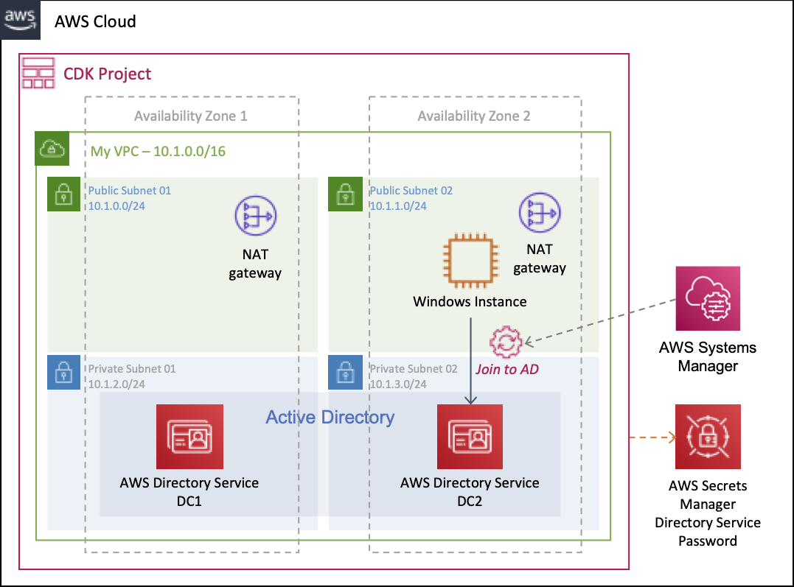
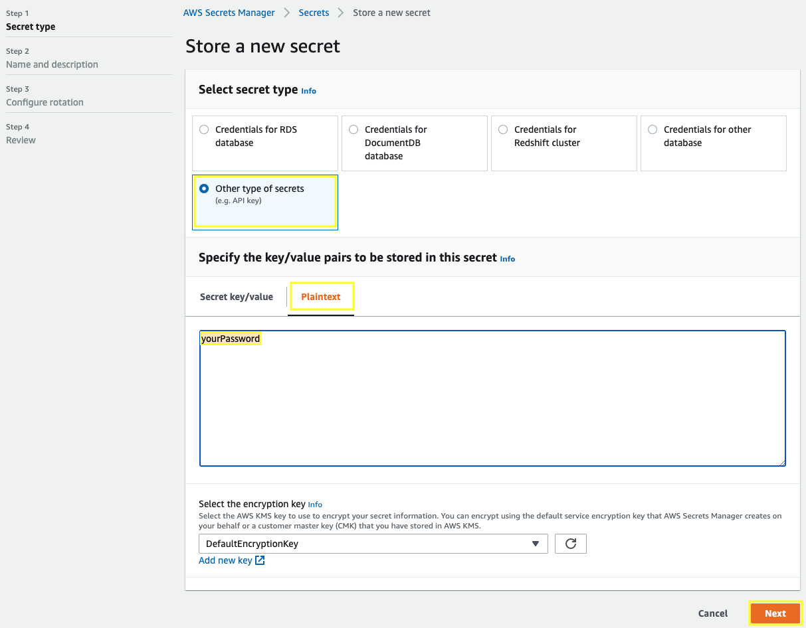

# AWS Directory Service with CDK



## Requirements for development environment

Work inside your AWS Cloud9 environment - [Create an EC2 Environment](https://docs.aws.amazon.com/cloud9/latest/user-guide/create-environment-main.html#create-environment-console)

Install the latest version of CDK.

``` bash
npm install -g aws-cdk --force
```

## Creating a basic secret to store the Direcotry Service password

Open the AWS Secrets Manager console at https://console.aws.amazon.com/secretsmanager/.

Choose **Store a new secret**.

In the **Select secret type** section, choose **Other type of secrets**, specify your password in **Plaintext** and choose **Next**.



For **Secret name**, type `directoryServicePassword` and choose **Next**.

For **Configure rotation** section, leave the default configuration and choose **Next**.

Review your settings, and then choose **Store** secret to save.

## Creating, initializing and deploying an AWS CDK project

Create a directory for your CDK project.

``` bash
mkdir cdk-directoryservice
cd cdk-directoryservice
```

To initialize your new CDK project use the cdk init command as follows.

``` bash
cdk init --language typescript
```

Install the AWS modules and all it’s dependencies into your project.

``` bash
npm install @aws-cdk/aws-ec2 @aws-cdk/aws-directoryservice @aws-cdk/aws-ssm @aws-cdk/aws-iam
```

Replace the following files with the samples codes linked.

- [lib/cdk-directoryservice-stack.ts](lib/cdk-directoryservice-stack.ts)
- [bin/cdk-directoryservice.ts](bin/cdk-directoryservice.ts)
  - Change the **directoryServiceName** value with the name for your directory service.
  - Change the **directoryServiceShortName** value with the short name for your directory service.
  - Change the **directoryServicePasswordSecret** value with the name of your secret.
- [test/cdk-directoryservice.test.ts](test/cdk-directoryservice.test.ts)

Build the project.

``` bash
npm run build
```

Deploy the stack, **it will take a few minutes to complete**.

``` bash
cdk deploy
```

## Connect to your Windows Manage AD instance

Open the Amazon EC2 console at https://console.aws.amazon.com/ec2.

Click on **Instances** in the **INSTANCES** section. This will display a page to manage your instances.

Select your **WindowsManageAD** and choose **Connect**.

Click on **Download Remote Desktop File** and **Close** the window.

Ope your **.rdp** file, you'll see the Remote Desktop Connection dialog box, for **Username** type the directory service name with the Admin user as follows: `aurbac.kabits.com\Admin` and type the password stored in AWS Secrets Manager.